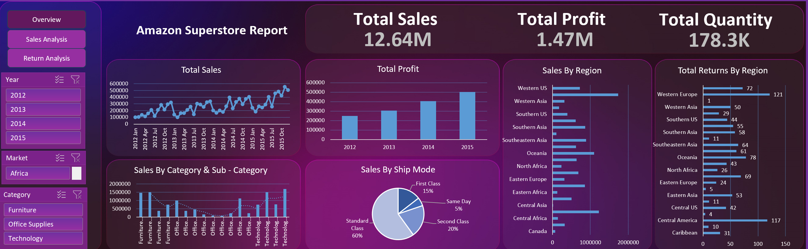
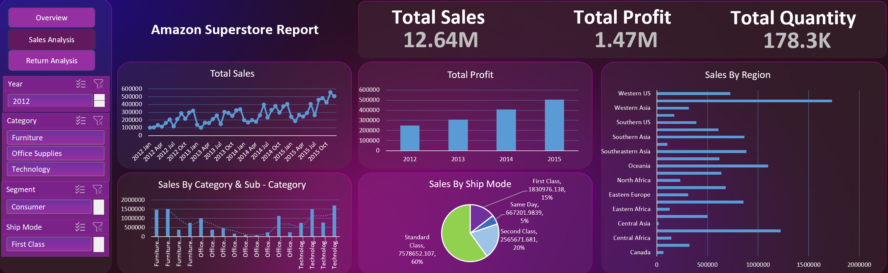
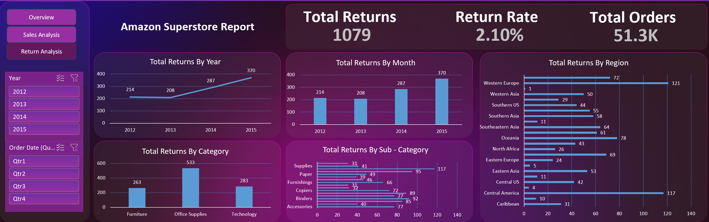

# 📊 Amazon Global Superstore Dashboard

## 📝 Problem Statement

The objective of this project is to analyze global retail data to evaluate sales performance, profitability, and operational efficiency.
While the business demonstrates strong revenue growth, there is limited visibility into profit drivers, return patterns, and regional performance.

This analysis aims to identify inefficiencies and provide actionable insights to support data-driven decision-making.

---

## 🚀 Project Overview

This project presents an interactive dashboard built using Microsoft Excel to analyze the Amazon Global Superstore dataset. The dashboard focuses on:

* Sales and profit trends over time
* Category and sub-category performance
* Regional sales distribution
* Return patterns and operational risks
* Shipping mode analysis

The goal is to move beyond descriptive reporting and highlight areas that require strategic intervention.

---

## 🛠 Tools and Techniques Used

* Microsoft Excel

  * Pivot Tables
  * Lookup Functions
  * Conditional Formatting
  * Dashboard Design

* Data Visualization Principles

* Business Analysis and Interpretation

---

## 📊 Key Metrics

* Total Sales: 12.64 Million
* Total Profit: 1.47 Million
* Total Orders: 51.3 Thousand
* Total Returns: 1,079
* Return Rate: 2.10 percent

---

## 🔍 Key Insights

### Sales and Profit Trends

* The business shows consistent growth from 2012 to 2015
* Profit growth is directly proportional to sales, indicating limited efficiency improvements

### Category Performance

* Technology is the most profitable category
* Office Supplies generates high sales volume but has lower profitability and the highest returns

### Regional Analysis

* Sales are concentrated in a few regions such as Western US and Oceania
* Some regions underperform, indicating potential market or operational challenges

### Returns Analysis

* Returns have increased steadily over time
* High return volumes are concentrated in specific regions such as Central America and Western Europe

### Shipping Analysis

* Standard Class dominates shipping usage
* Faster shipping options are underutilized

---

## ⚠️ Business Challenges Identified

* Rising return rates without clear mitigation strategies
* High-volume categories with low efficiency
* Uneven regional performance
* Limited focus on profit optimization
* Underutilization of premium shipping methods

---

## 💡 Recommendations

* Improve return management through product and logistics analysis
* Optimize product portfolio by focusing on high-margin categories
* Strengthen strategy for underperforming regions
* Introduce incentives for faster shipping options
* Shift focus from revenue growth to profitability improvement

---

## 📷 Dashboard Preview

### Overview

### Sales Analysis

### Return Analysis

---

## 📂 Files Included

* Dataset: 
* Dashboard Report (Excel)

---

## 🧠 Key Learning Outcomes

* End-to-end data analysis using Excel
* Dashboard design and structuring
* Translating data into actionable business insights
* Identifying inefficiencies and optimization opportunities

---

## 📌 Conclusion

The analysis highlights that while the business is growing in terms of sales, it faces challenges in profitability and operational efficiency. Addressing return patterns, optimizing product categories, and improving regional strategies are critical for sustainable growth.

---

## 📞 Contact

For queries or collaboration, feel free to connect via LinkedIn or portfolio platforms.

---
